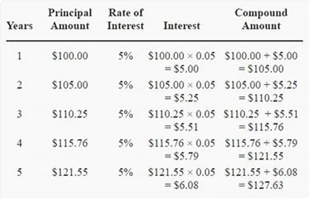

```{r setup, include=FALSE}
knitr::opts_chunk$set(echo = FALSE)

# Learn more about creating websites with Distill at:
# https://rstudio.github.io/distill/website.html

```

> Word of wisdoms ...  

<html>
<title>W3.CSS</title>
<meta name="viewport" content="width=device-width, initial-scale=1">
<link rel="stylesheet" href="https://www.w3schools.com/w3css/4/w3.css">
<style>
  .mySlides {display:none}
</style>
<body>
  
<div class="w3-container">
  <h2>Learning Slides</h2>
  <p>Students can use these slides presentation to understand the content of this chapter</p>
</div>
<div class="w3-content" style="max-width:800px">
  
  
  
  
  
  
  
  
  
  
  
  
</div>
<div class="w3-center">
  <button class="w3-button w3-light-grey" onclick="plusDivs(-1)">Prev</button>
  <button class="w3-button w3-light-grey" onclick="plusDivs(1)">Next</button>
</div>
<div class="w3-center">
  <button class="w3-button demo" onclick="currentDiv(1)">1</button> 
  <button class="w3-button demo" onclick="currentDiv(2)">2</button> 
  <button class="w3-button demo" onclick="currentDiv(3)">3</button>
  <button class="w3-button demo" onclick="currentDiv(4)">4</button>
  <button class="w3-button demo" onclick="currentDiv(5)">5</button> 
  <button class="w3-button demo" onclick="currentDiv(6)">6</button> 
  <button class="w3-button demo" onclick="currentDiv(7)">7</button>
  <button class="w3-button demo" onclick="currentDiv(8)">8</button>
  <button class="w3-button demo" onclick="currentDiv(9)">9</button> 
  <button class="w3-button demo" onclick="currentDiv(10)">10</button> 
  <button class="w3-button demo" onclick="currentDiv(11)">11</button>
  <button class="w3-button demo" onclick="currentDiv(12)">12</button>
</div>
  
<script>
var slideIndex = 1;
showDivs(slideIndex);

function plusDivs(n) {
  showDivs(slideIndex += n);
}

function currentDiv(n) {
  showDivs(slideIndex = n);
}

function showDivs(n) {
  var i;
  var x = document.getElementsByClassName("mySlides");
  var dots = document.getElementsByClassName("demo");
  if (n > x.length) {slideIndex = 1}    
  if (n < 1) {slideIndex = x.length}
  for (i = 0; i < x.length; i++) {
    x[i].style.display = "none";  
  }
  for (i = 0; i < dots.length; i++) {
    dots[i].className = dots[i].className.replace(" w3-red", "");
  }
  x[slideIndex-1].style.display = "block";  
  dots[slideIndex-1].className += " w3-red";
}
</script>
  
</body>
</html>  

<aside>  
[Download Learning Slides](files/slides/compound.pdf)
</aside>  


### Background  
In this chapter students will be introduced on the concepts of time value of money. In addition, students will learn how use the compound amount formula to find the future value, compound interest, and present value of investments and loans.  

### Time value of money  
> The time value of money (TVM) is the concept that money you have now is worth more than the identical sum in the future due to its potential earning capacity. This core principle of finance holds that provided money can earn interest, any amount of money is worth more the sooner it is received. TVM is also sometimes referred to as present discounted value.  
The time value of money draws from the idea that rational investors prefer to receive money today rather than the same amount of money in the future because of money's potential to grow in value over a given period of time. For example, money deposited into a savings account earns a certain interest rate and is therefore said to be compounding in value (Chan, 2020).  

*Key Takeaways*  

1. Time value of money is based on the idea that people would rather have money today than in the future.  

2. Given that money can earn compound interest, it is more valuable in the present rather than the future.  

3. The formula for computing time value of money considers the payment now, the future value, the interest rate, and the time frame.  

4. The number of compounding periods during each time frame is an important determinant in the time value of money formula as well.  


### What is compound interest?  

In compound interest, interest is earned on both the principal and any interest that has been earned previously. In this situation each time the interest is calculated, it is based on the new principal value that include the previous amount of interest. Thus, the interest is calculated on the current value of principal at the time of calculation.  
The process is illustrated in the table shown below.  

<center>  
  
</center>  


This is a bit different from simple interest as illustrated in the image shown below.  

<center>  
{caption="Simple Interest vs Compound Interest"}  
</center>  

### Important terms use in compound interest  


### Compound interest formula  
The mathematical formula for calculating compound interest depends on several factors These factors include the amount of money deposited called the principal ($P$), the annual interest rate $k$ (in decimal form), the numberof times the money is compounded per year ($m$), and the number of years ($t$) the money is left in the bank These factors lead to the formula,  

$$
\begin {aligned}
S\ &=\ P(1+i)^n \\
\\
where,\ S\ &=\ Compound\ Amount \\
P\ &=\ Initial\ Principal \\
i\ &=\ \frac{k}{m} \\
n\ &=\ mt
\end {aligned}
$$  
Thus, the compound interest can be calculated by subtracting the compound amount, S from the initial principal, P.  

$$
\begin {aligned}
I\ = S\ -\ P
\end {aligned}
$$  

### Determining the value of $m$  
Given the interest of $k\%$ compounded $m$, the value of $m$ is shown in the table below:  

| $k\%$ compounded $m$ | m |  
|:--------------------:|:-:|  
| annualy (every year) | 1 |  
| semi-annualy (every six months) | 2 |  
| every four months | 3 |  
| quarterly (every three months) | 4 |  
| every two months | 6 |  
| monthly (every month) | 12 |  
| weekly (every weeks) | 52 |  
| daily (every day)* | 360 |  
*Note:* *Banker's Rule  

**Example** if interest is $3.5\%$ compounded monthly, the $k = 3.5\%$ and $m = 12$.  

### Present Value  
The following formula can be used to find the present value of a compound amount. In genearal, the present value is simply the intial principal of investment or loan.  

$$
P\ =\ \frac{S}{(1+i)^n}\ = S(1+i)^{-n}
$$  


**Important Keywords**  
$P$ ---> saved, invested, borrowed, deposited  
$S$ ---> total payment, total savings, accumulated amount  

### Exercises  


## Acknowledgements {.appendix}  
Chan, J. (2020). *Time Value of Money (TVM)*. Retrieved from https://www.investopedia.com/terms/t/timevalueofmoney.asp on March 8, 2020.  
